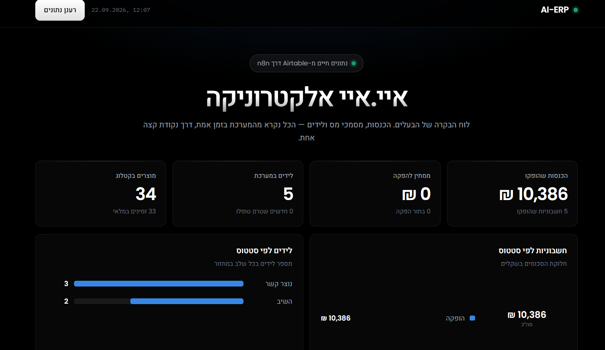
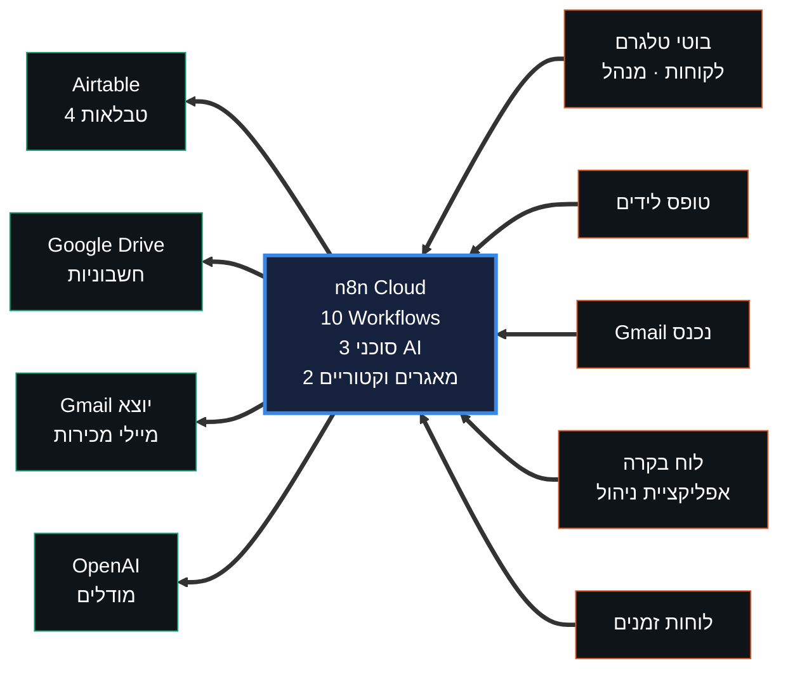
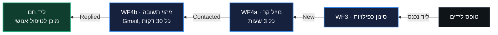
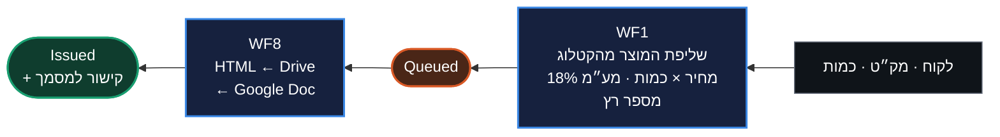
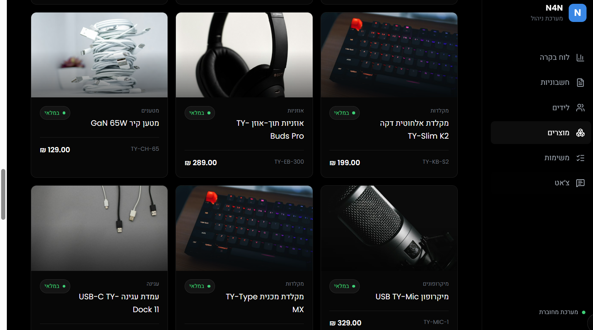
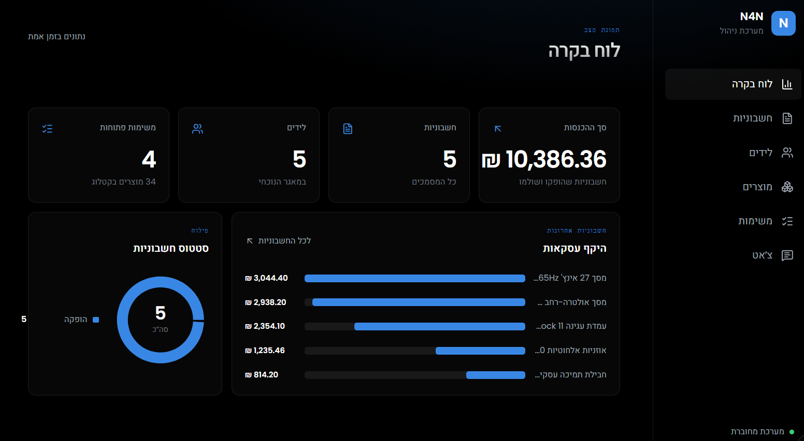
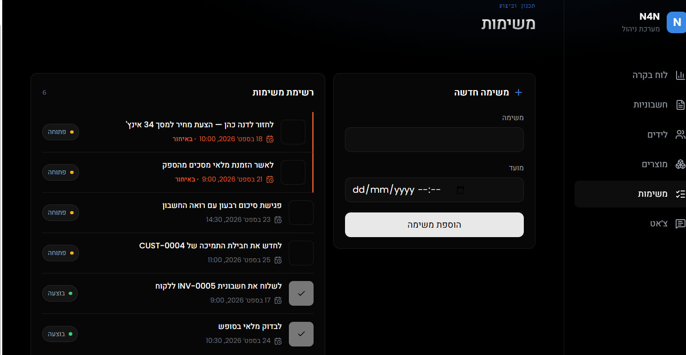
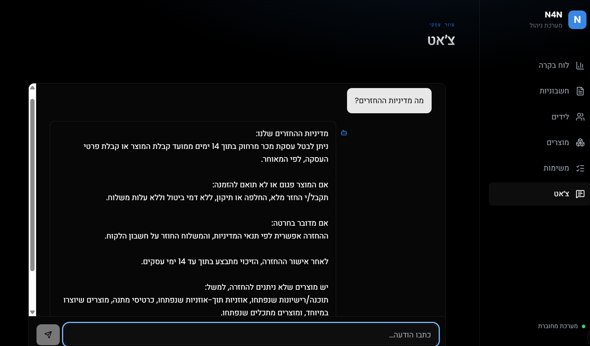

<div align="center">

# AI-ERP

**מערכת ניהול עסק חכמה**

פרויקט גמר · ג'ון ברייס

מערכת ERP קטנה לעסק אלקטרוניקה ישראלי, שבה סוכני בינה מלאכותית
ותהליכי אוטומציה מבצעים את רוב העבודה התפעולית.

<br>


<br>

### [↗ פתח את לוח הבקרה החי](https://nazulay4-wq.github.io/erp-ai-n8n/dashboard.html)

<br>



</div>

<br>

<div align="center">

| | | | | |
|:---:|:---:|:---:|:---:|:---:|
| **0** | **10** | **34** | **191** | **18%** |
| שורות קוד | Workflows | מוצרים בקטלוג | קטעים ב-RAG | מע"מ אוטומטי |

</div>

<br>

---

## מה המערכת עושה

<table>
<tr>
<td width="50%" valign="top">

### לידים
קליטה מטופס, סינון כפילויות, מייל קר אוטומטי, וזיהוי תשובה מהג'ימייל — בלי נגיעה אנושית.

</td>
<td width="50%" valign="top">

### שירות לקוחות
בוט טלגרם שעונה **רק** מתוך מסמכי המדיניות והקטלוג. לא יודע? מפנה לנציג.

</td>
</tr>
<tr>
<td valign="top">

### מסמכי מס
מזינים לקוח, מק"ט וכמות. המערכת שולפת מחיר מהקטלוג, מחשבת מע"מ, ממספרת, ומפיקה חשבונית מעוצבת.

</td>
<td valign="top">

### הנהלה
בוט טלגרם לבעלים עם נתוני הכנסות חיים, מוגן בשער זהות לפי `chat.id`.

</td>
</tr>
<tr>
<td valign="top">

### משימות
מעקב אחר משימות ופגישות. נקרא ונכתב מהאפליקציה דרך אותו webhook.

</td>
<td valign="top">

### ממשק
לוח בקרה לבעלים ואפליקציית ניהול — שניהם מדברים עם כתובת אחת בלבד.

</td>
</tr>
</table>

> **אפס שורות קוד.** כל הלוגיקה מיושמת בצמתים מוכנים של n8n.

---

## ארכיטקטורה



שלוש שכבות: **ממשק** · **לוגיקה** · **נתונים**. שתי שכבות הממשק מדברות עם
Webhook יחיד ולא נוגעות ב-Airtable ישירות, כך שמפתח ה-API לעולם לא מגיע לדפדפן.

פירוט מלא: [`docs/architecture.md`](docs/architecture.md)

---

## עשרת ה-Workflows

| WF | מה עושה | טריגר |
|:---:|:---|:---|
| **1** | אימות מסמכי מס, שליפת מוצר, מע"מ ומספור רץ | חשבונית חדשה |
| **3** | קליטת לידים וסינון כפילויות | Webhook |
| **4a** | מיילים קרים ללידים | כל 3 שעות |
| **4b** | זיהוי תשובה ועדכון סטטוס | Gmail · כל 30 דק' |
| **5** | סוכן שירות לקוחות | בוט טלגרם |
| **6** | מדיניות ← מאגר וקטורי | ידני |
| **7** | מוצרים ← מאגר וקטורי | ידני |
| **8** | הפקת חשבונית והעלאה לדרייב | כל שעה |
| **9** | סוכן המנהל | בוט טלגרם |
| **13** | שער ה-API לממשקים | Webhook |

המספור נשמר יציב לפי מפרט הפרויקט — 2, 10, 11 ו-12 הושמטו בכוונה.

> **WF6 ו-WF7 נשארים ידניים לתמיד.** המאגר הווקטורי יושב בזיכרון של n8n
> ונמחק בכל הפעלה מחדש; יש להריץ אותם שוב לפני כל שימוש בסוכנים.

---

## מחזור הלידים

שלושה תהליכים נפרדים, ששרשרו זה לזה דרך שדה `Status` אחד:



אף תהליך לא יודע על האחרים. כל אחד מסתכל על `Status`, עושה את שלו, ומקדם אותו.

## מסלול מסמכי המס

מזינים **לקוח · מק"ט · כמות** — וזהו. כל השאר מחושב.



זה הקשר היחיד במערכת שבו שתי טבלאות באמת מדברות ביניהן: WF1 מחפש
ב-`Products` לפי המק"ט ומביא משם שם ומחיר. אי אפשר להוציא חשבונית על
מוצר שאינו בקטלוג, ואי אפשר לטעות במחיר.

---

## הקטלוג

**34 מוצרים ב-13 קטגוריות** — 22 מוצרים פיזיים ו-12 שירותים.

<div align="center">
<table>
<tr>
<td align="center" width="25%"><br><b>אוזניות</b></td>
<td align="center" width="25%"><br><b>מסכים</b></td>
<td align="center" width="25%"><br><b>מקלדות</b></td>
<td align="center" width="25%"><br><b>עכברים</b></td>
</tr>
<tr>
<td align="center"><br><b>רמקולים</b></td>
<td align="center"><br><b>מצלמות רשת</b></td>
<td align="center"><br><b>אחסון</b></td>
<td align="center"><br><b>שירותים</b></td>
</tr>
</table>
</div>

כל מוצר נושא שדה `ImageUrl`, וכך התמונה מגיעה **מהנתונים ולא מהקוד** —
הוספנו יכולת שלמה למערכת בלי לגעת באף Workflow.

---

## אפליקציית הניהול

שישה מסכים, ונקודת קצה אחת. האפליקציה אינה מכירה את Airtable ואין בה
אף מפתח — כל קריאה עוברת ב-Webhook של WF13.

<div align="center">
<table>
<tr>
<td align="center" width="50%"><br><b>מוצרים</b><br><sub>רשת כרטיסים עם תמונה מ-<code>ImageUrl</code></sub></td>
<td align="center" width="50%"><br><b>לוח בקרה</b><br><sub>ארבעה מדדים, היקף עסקאות וסטטוס חשבוניות</sub></td>
</tr>
<tr>
<td align="center"><br><b>משימות</b><br><sub>יצירה וסימון כבוצעה — כתיבה חוזרת ל-Airtable</sub></td>
<td align="center"><br><b>צ'אט</b><br><sub>אותו סוכן RAG שעונה גם בטלגרם</sub></td>
</tr>
</table>
</div>

---

## מבנה הריפו

```
workflows/        10 קובצי JSON לייבוא ל-n8n
knowledge-base/   12 מסמכי מדיניות + קובץ מאוחד למאגר הווקטורי
data/             קטלוג המוצרים וסכימת Airtable
docs/             ארכיטקטורה · התקנה · חוזה API · העברה · פרומפט האפליקציה
screenshots/      צילומי מסך להגשה
dashboard.html    לוח הבקרה לבעלים
```

## תיעוד

| קובץ | עונה על השאלה |
|:---|:---|
| [`docs/architecture.md`](docs/architecture.md) | איך המערכת בנויה, ולמה כל החלטה התקבלה |
| [`docs/setup.md`](docs/setup.md) | איך מקימים אותה מאפס |
| [`docs/api-contract.md`](docs/api-contract.md) | איך מדברים איתה |
| [`docs/migration-checklist.md`](docs/migration-checklist.md) | איך מעבירים למופע n8n אחר |
| [`docs/app-prompt.md`](docs/app-prompt.md) | איך נבנתה אפליקציית הניהול |

---

<details>
<summary><b>מגבלות מוכרות</b> — בחירות תכנון מודעות, לא באגים</summary>

<br>

| מגבלה | למה זו בחירה |
|:---|:---|
| המאגר הווקטורי בזיכרון | פשטות; המחיר הוא הרצה ידנית של WF6/WF7 אחרי כל restart |
| החשבונית היא Google Doc ולא PDF | הדרייב אינו מציג HTML; ייצוא ל-PDF נעשה מתוך המסמך |
| טריגרי Airtable סורקים במרווחים | אין webhook יוצא ב-Airtable בתוכנית החינמית |
| מספור עלול להתנגש בשתי חשבוניות באותה דקה | Autonumber אינו ניתן לכתיבה מ-n8n |
| Google OAuth במצב Testing | טוקן הרענון פג אחרי 7 ימים |
| אין טיפול בשגיאות וניסיונות חוזרים | כשל נראה אדום ב-Executions — מספיק להדגמה |
| סוכן המנהל רואה עד 100 חשבוניות | המספרים מחושבים לפניו, לא על ידו |
| WF4a שולח ליד אחד בכל הרצה | כדי שטעות לא תשלח עשרות מיילים |
| ענף העדכון ב-WF13 מעדכן `Status` בלבד | נוד HTTP אחד משרת את כל הטבלאות |
| משימות נוצרות ידנית | אין עדיין תהליך שיוצר אותן אוטומטית |

</details>

<details>
<summary><b>אבטחה</b></summary>

<br>

קובצי ה-workflow שבריפו **אינם מכילים מפתחות או סיסמאות** — רק שמות
ה-credentials כפי שהם מוגדרים ב-n8n. את החיבורים עצמם יש להגדיר מחדש
בכל מופע, לפי [`docs/setup.md`](docs/setup.md).

מפתח ה-API של Airtable נשאר בתוך n8n ולעולם אינו מגיע לדפדפן — זו הסיבה
שהממשקים מדברים עם WF13 ולא עם Airtable ישירות.

ה-Webhook של WF13 פתוח וללא אימות — בחירה מודעת לצורך הדגמה. במערכת
אמיתית היה נוסף לו בדיקת `x-api-key` בצומת ה-Switch.

בוט המנהל מוגן בשער זהות לפי `chat.id`; הודעה מכל מזהה אחר נחסמת.

</details>
