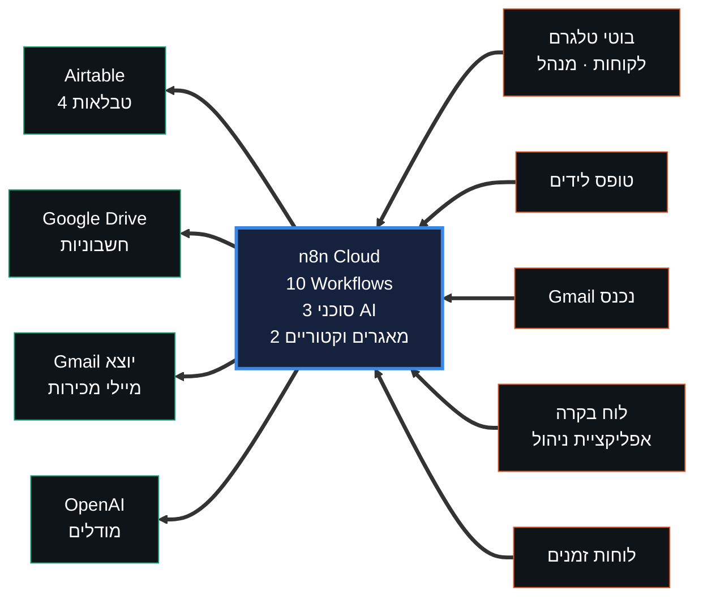
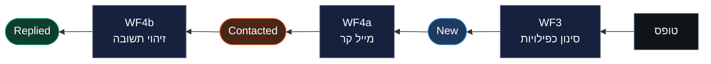
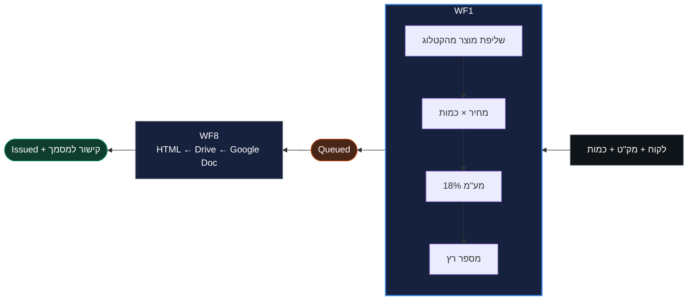

<div align="center">

# AI-ERP

### מערכת ניהול עסק חכמה · פרויקט גמר · ג'ון ברייס

מערכת ERP קטנה לעסק אלקטרוניקה ישראלי, שבה סוכני בינה מלאכותית
ותהליכי אוטומציה מבצעים את רוב העבודה התפעולית.


**[↗ לוח הבקרה החי](https://nazulay4-wq.github.io/erp-ai-n8n/dashboard.html)**

</div>

---

<div align="center">


</div>

---

## מה המערכת עושה

| תחום | מה קורה אוטומטית |
|:---|:---|
| **לידים** | קליטה מטופס · סינון כפילויות · מייל קר · זיהוי תשובה |
| **שירות לקוחות** | בוט טלגרם שעונה מתוך מסמכי המדיניות והקטלוג (RAG) |
| **מסמכי מס** | שליפת מוצר מהקטלוג · תמחור · מע"מ 18% · מספור רץ · חשבונית מעוצבת |
| **הנהלה** | בוט טלגרם לבעלים עם נתוני הכנסות, מוגן בשער זהות |
| **משימות** | מעקב אחר משימות ופגישות, נקרא ונכתב מהאפליקציה |
| **ממשק** | לוח בקרה לבעלים · אפליקציית ניהול — שניהם דרך webhook יחיד |

**אפס שורות קוד.** כל הלוגיקה מיושמת בצמתים מוכנים של n8n.

---

## ארכיטקטורה



שלוש שכבות: **ממשק** (לוח בקרה + אפליקציה) · **לוגיקה** (n8n) · **נתונים** (Airtable).
שתי שכבות הממשק מדברות עם Webhook יחיד ולא נוגעות ב-Airtable ישירות,
כך שמפתח ה-API לעולם לא מגיע לדפדפן.

פירוט מלא: [`docs/architecture.md`](docs/architecture.md)

---

## עשרת ה-Workflows

| WF | מה עושה | טריגר |
|:---:|:---|:---|
| **1** | אימות מסמכי מס, שליפת מוצר, מע"מ ומספור רץ | חשבונית חדשה |
| **3** | קליטת לידים וסינון כפילויות | Webhook |
| **4a** | מיילים קרים ללידים | כל 3 שעות |
| **4b** | זיהוי תשובה ועדכון סטטוס | Gmail · כל 30 דק' |
| **5** | סוכן שירות לקוחות | בוט טלגרם |
| **6** | מדיניות ← מאגר וקטורי | ידני |
| **7** | מוצרים ← מאגר וקטורי | ידני |
| **8** | הפקת חשבונית והעלאה לדרייב | כל שעה |
| **9** | סוכן המנהל | בוט טלגרם |
| **13** | שער ה-API לממשקים | Webhook |

המספור נשמר יציב לפי מפרט הפרויקט — 2, 10, 11 ו-12 הושמטו בכוונה.

> **WF6 ו-WF7 נשארים ידניים לתמיד.** המאגר הווקטורי יושב בזיכרון של n8n
> ונמחק בכל הפעלה מחדש; יש להריץ אותם שוב לפני כל שימוש בסוכנים.

---

## מחזור הלידים

שלושה תהליכים נפרדים ששרשרו דרך שדה `Status` אחד:



## מסלול מסמכי המס

מזינים **לקוח · מק"ט · כמות** — וזהו. כל השאר מחושב.



זה הקשר היחיד במערכת שבו שתי טבלאות באמת מדברות ביניהן: WF1 מחפש
ב-`Products` לפי המק"ט ומביא משם שם ומחיר. אי אפשר להוציא חשבונית על
מוצר שאינו בקטלוג, ואי אפשר לטעות במחיר.

---

## הקטלוג

34 מוצרים ב-13 קטגוריות — מוצרים פיזיים ו-12 שירותים.

<div align="center">

   

<sub>אוזניות · מסכים · מקלדות · רמקולים — ועוד תשע קטגוריות</sub>

</div>

כל מוצר נושא `ImageUrl`, וכך התמונה מגיעה מהנתונים ולא מהקוד —
בלי לגעת באף Workflow.

---

## מבנה הריפו

```
workflows/        10 קובצי JSON לייבוא ל-n8n
knowledge-base/   12 מסמכי מדיניות + קובץ מאוחד למאגר הווקטורי
data/             קטלוג המוצרים וסכימת Airtable
docs/             ארכיטקטורה · התקנה · חוזה API · העברה · תסריט הסרטון
screenshots/      צילומי מסך להגשה
dashboard.html    לוח הבקרה לבעלים
```

## תיעוד

| קובץ | עונה על |
|:---|:---|
| [`docs/architecture.md`](docs/architecture.md) | איך המערכת בנויה, ולמה כל החלטה התקבלה |
| [`docs/setup.md`](docs/setup.md) | איך מקימים אותה מאפס |
| [`docs/api-contract.md`](docs/api-contract.md) | איך מדברים איתה |
| [`docs/migration-checklist.md`](docs/migration-checklist.md) | איך מעבירים למופע n8n אחר |
| [`docs/app-prompt.md`](docs/app-prompt.md) | הפרומפט שבנה את אפליקציית הניהול |

---

<details>
<summary><strong>מגבלות מוכרות</strong> — בחירות תכנון מודעות, לא באגים</summary>

<br>

- המאגר הווקטורי בזיכרון — נמחק בכל restart של n8n
- החשבונית היא מסמך Google ולא PDF; ייצוא נעשה מתוך המסמך בעת הצורך
- טריגרי Airtable סורקים כל דקה לפחות ומסתמכים על שדה `Created time`
- מספור חשבוניות עלול להתנגש אם שתיים נוצרות באותה דקה
- Google OAuth במצב Testing — טוקן הרענון פג אחרי 7 ימים
- אין טיפול בשגיאות ואין ניסיונות חוזרים; כשל נראה אדום ב-Executions
- סוכן המנהל רואה עד 100 חשבוניות ואינו מקבל כלים
- WF4a שולח ליד אחד בכל הרצה, כדי שטעות לא תשלח עשרות מיילים
- ענף העדכון ב-WF13 מעדכן את שדה `Status` בלבד
- משימות נוצרות ידנית מהאפליקציה; אין עדיין תהליך שיוצר אותן אוטומטית

</details>

<details>
<summary><strong>אבטחה</strong></summary>

<br>

קובצי ה-workflow שבריפו **אינם מכילים מפתחות או סיסמאות** — רק שמות
ה-credentials כפי שהם מוגדרים ב-n8n. את החיבורים עצמם יש להגדיר מחדש
בכל מופע, לפי [`docs/setup.md`](docs/setup.md).

ה-Webhook של WF13 פתוח וללא אימות — בחירה מודעת לצורך הדגמה. במערכת
אמיתית היה נוסף לו בדיקת `x-api-key` בצומת ה-Switch.

בוט המנהל מוגן בשער זהות לפי `chat.id`; הודעה מכל מזהה אחר נחסמת.

</details>
